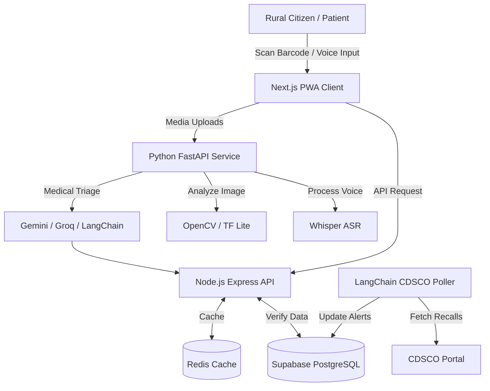

<div align="center">


<br/><br/>

# SahiDawa (सही दवा)

### Open-Source Medicine Safety Infrastructure

A robust, citizen-facing verification platform providing real-time anti-counterfeit checks and regulatory monitoring for the Indian healthcare ecosystem.

[**Documentation**](./docs/) · [**Report Issue**](https://github.com/RatLoopz/sahidawa-india/issues/new?template=bug_report.md) · [**Join Discord**](https://discord.gg/6Qa6VuE6)

</div>

---

## 🔗 Quick Links

- 🌐 [RatLoopz Collective Website](https://ratloopz.vercel.app/)

- 📖 [Documentation](./docs/)
- 📝 [Architecture Decision Records (ADRs)](./docs/adr/)
- 🚀 [Getting Started](#-getting-started)
- 🤝 [Contributing Guide](./CONTRIBUTING.md)
- 🌏 [Supported Languages](#-supported-languages)
- 📜 [License](#-license)
- 🐛 [Report a Bug](https://github.com/RatLoopz/sahidawa-india/issues/new?template=bug_report.md)
- 💡 [Request a Feature](https://github.com/RatLoopz/sahidawa-india/issues/new?template=feature_request.md)


## Table of Contents

- [🩺 SahiDawa — सही दवा](#-sahidawa--सही-दवा)
- [🚨 The Problem We're Solving](#-the-problem-were-solving)
- [✨ What SahiDawa Does](#-what-sahidawa-does)
- [🏗️ Architecture](#%EF%B8%8F-architecture)
- [🛠️ Tech Stack](#%EF%B8%8F-tech-stack)
- [🗺️ Roadmap & Phases](#%EF%B8%8F-roadmap--phases)
- [🚀 Getting Started](#-getting-started)
- [📁 Project Structure](#-project-structure)
- [🤝 Contributing](#-contributing)
- [🌏 Supported Languages](#-supported-languages)
- [📊 Data Sources (All Free & Public)](#-data-sources-all-free--public)
- [💬 Community](#-community)
- [📜 License](#-license)
- [👥 Contributors](#-contributors)
- [🙏 Acknowledgements](#-acknowledgements)
- [❤️ Why Open Source?](#%EF%B8%8F-why-open-source)

---

## Motivation

India's healthcare supply chain faces significant infrastructural challenges that compromise patient safety:

| Systemic Challenge                                                  | Affected Population        | Current Gap                                                  |
| ------------------------------------------------------------------- | -------------------------- | ------------------------------------------------------------ |
| 12–25% of medical circulation is substandard or counterfeit         | 1.4 billion citizens       | Lack of accessible, citizen-facing verification tools        |
| 65% of the population resides in underserved rural districts        | 900M+ individuals          | Telemedicine platforms often require high-bandwidth connections |
| Linguistic diversity (22 official scheduled languages)              | 500M+ non-Hindi speakers   | Medical documentation is disproportionately English/Hindi    |

SahiDawa addresses these gaps by providing an open-source, multilingual, and offline-capable verification layer that connects end-consumers directly to the Central Drugs Standard Control Organisation (CDSCO) registry.

---

## System Capabilities

SahiDawa operates as a decentralized counterfeit intelligence network, executing real-time pharmaceutical validation and telemetry.

### Core Workflow

- **Scan & Verify**: Cross-reference physical product batches against the CDSCO registry.
- **Risk Triage**: Flag active regulatory recalls and Look-Alike Sound-Alike (LASA) risks.
- **Crowdsourced Telemetry**: Aggregate consumer reports of suspicious pharmaceutical products.
- **Geospatial Analytics**: Map counterfeit clusters at the district level for regulatory visibility.
- **Autonomous Alerts**: Dispatch localized safety notifications when systemic risks are detected.

### Feature Matrix

| Subsystem                     | Capability Description                                        | Implementation Status |
| ----------------------------- | ------------------------------------------------------------- | --------------------- |
| **Verification Engine**       | Client-side barcode/QR scanning linked to CDSCO registry      | ✅ Complete          |
| **Visual Validation**         | Cloudinary-accelerated packaging structural comparison        | ✅ Complete          |
| **Multilingual Voice Triage** | Speech-to-text processing across 22 regional languages        | ✅ Complete          |
| **Geospatial Infrastructure** | PostGIS-backed routing for state pharmacies and ASHA workers  | ✅ Complete          |
| **Telemetry Dashboard**       | District-level aggregation of counterfeit incident reports    | ✅ Complete          |
| **Regulatory Agent**          | Background worker continuously parsing CDSCO recall notices   | ✅ Complete          |
| **Offline Resilience**        | Service worker architecture for zero-connectivity environments| ✅ Complete          |

---

## 🏗️ Architecture

Major architectural decisions (Turborepo, Supabase, Redis, LangGraph, Next.js, and more) are documented as **Architecture Decision Records (ADRs)**. Start with the [ADR index](./docs/adr/README.md) and the foundational [ADR 0006 — Record Architecture Decisions](./docs/adr/0006-record-architecture-decisions.md) for the "why" behind our tech stack.



---

## 🛠️ Tech Stack

### Frontend

- **[Next.js 16](https://nextjs.org/)** — React 19 framework with App Router + SSR
- **[Tailwind CSS 4.0](https://tailwindcss.com/)** — High-performance utility-first CSS
- **[shadcn/ui](https://ui.shadcn.com/)** — UI components
- **[Workbox](https://developer.chrome.com/docs/workbox/)** — PWA offline caching
- **[@zxing/browser](https://github.com/zxing-js/library)** — In-browser barcode/QR scanning
- **[Leaflet.js](https://leafletjs.com/)** + **OpenStreetMap** — Maps (free, no API key)
- **[next-intl](https://next-intl-docs.vercel.app/)** — i18n for 22 Indian languages

### Backend

- **[Node.js 22](https://nodejs.org/)** + **[Express 5.0](https://expressjs.com/)** + **TypeScript** — API server
- **[Redis](https://redis.io/)** (Upstash free tier) — Drug lookup caching
- **[FastAPI](https://fastapi.tiangolo.com/)** + **Python** — ML microservice

### AI / ML

- **[OpenCV Python](https://opencv.org/)** — Server-side image preprocessing
- **[TensorFlow Lite](https://www.tensorflow.org/lite)** — Fast packaging/logo classifier
- **[Whisper](https://github.com/openai/whisper)** (Faster-Whisper) — Voice input, 22 languages
- **[Gemini 2.0 Flash](https://deepmind.google/technologies/gemini/)** + **[Groq LLaMA 3.1](https://groq.com/)** — Dual-LLM for safety profiles & medical RAG
- **[LangChain](https://python.langchain.com/)** / **[LangGraph](https://www.langchain.com/langgraph)** — RAG pipeline + agent orchestration

### Database & Storage

- **[PostgreSQL](https://www.postgresql.org/)** + **[PostGIS](https://postgis.net/)** — Primary DB + geo queries
- **[pgvector](https://github.com/pgvector/pgvector)** — Vector search for RAG
- **[Supabase](https://supabase.com/)** — Managed Postgres (free tier for dev)
- **[Cloudinary](https://cloudinary.com/)** — Medicine photo storage + image analysis

### Infrastructure

- **[Docker](https://www.docker.com/)** + **Docker Compose** — Containerization
- **[GitHub Actions](https://github.com/features/actions)** — CI/CD
- **[Vercel](https://vercel.com/)** — Frontend deployment (free)
- **[Railway](https://railway.app/)** — Backend deployment (free tier)

---

## 🗺️ Roadmap & Phases

### Phase 1 — Foundation & Core Scanner

- [x] Project scaffolding (Next.js + TypeScript + Tailwind)
- [x] CDSCO drug database scraper + PostgreSQL schema
- [x] Barcode/QR scanner UI (ZXing)
- [x] Medicine lookup REST API
- [x] Supabase integration
- [x] GitHub Actions CI pipeline
- [x] English UI with i18n setup

### Phase 2 — Map + Multilingual + Offline

- [x] PostGIS pharmacy + ASHA worker map (Leaflet.js)
- [x] i18n system — 22 Indian language JSON files
- [x] Cloudinary photo upload integration
- [x] Offline PWA (Workbox cache strategies)
- [x] FastAPI ML microservice scaffolding
- [x] Redis caching for drug lookups
- [x] OpenCV/TFLite packaging geometry detection

### Phase 3 — AI Health Assistant + Agents

- [x] TF Lite medicine image classifier
- [x] Whisper ASR voice input (22 languages)
- [x] Gemini + Groq dual-LLM health assistant
- [x] CDSCO drug alert monitoring agent (LangGraph)
- [x] Counterfeit heatmap + Recharts visualization
- [x] Push notification system for district alerts

### Phase 4 — Polish, Security & Launch

- [x] WCAG 2.1 accessibility audit
- [x] Lighthouse CI (target 90+ score)
- [x] Docker Compose for self-hosting
- [x] OpenAPI/Swagger documentation
- [x] ABHA health card integration (optional)
- [x] Public launch

### Phase 5 — Scaling & Reliability (Current Phase 🚧)

- [ ] Database query optimization and scaling
- [ ] Enhanced security hardening and auditing
- [ ] Advanced error tracking and telemetry integration
- [ ] Continued language translation and localization

---


## 🚀 Getting Started

### Prerequisites

| Software | Minimum Version |
|----------|-----------------|
| Node.js | 20+ |
| Python | 3.10+ |
| Docker *(optional)* | 24+ |


### Clone the Repository

```bash
git clone https://github.com/RatLoopz/sahidawa-india.git
cd sahidawa-india
```

### Configure Environment

```bash
# Copy example environment files for both frontend and backend
cp .env.example apps/web/.env.local
cp .env.example apps/api/.env
```

Update the environment variables in both files before running the project.

### Install Dependencies

Install all dependencies for the entire monorepo workspaces from the root directory:

```bash
npm install
```

### Run the Development Server

Start all services (Next.js web app, Express API) concurrently using Turborepo:

```bash
npm run dev
```

- **Frontend:** http://localhost:3000
- **API Server:** http://localhost:4000
- **API Reference:** http://localhost:4000/api/docs

| Command | Description |
|---------|-------------|
| `npm install` | Install all workspace dependencies |
| `npm run dev` | Start development servers concurrently |
| `npm run build` | Build all projects for production |
| `npm run lint` | Run lint checks across workspaces |


### ⚠️ Troubleshooting npm install Failures

If you encounter `No matching version found` errors while running `npm install`, it may be caused by the canary package versions used in this project.

Try running:

```bash
npm install --legacy-peer-deps
```

or:

```bash
npm install --force
```

If the issue still persists, you may temporarily downgrade package versions locally to get the project running on your machine.

> ⚠️ Important:
> Do not commit modified `package.json` or `package-lock.json` files created during local downgrades. Revert those changes before pushing your PR.

### Full Stack with Docker

```bash
# Clone and start everything
git clone https://github.com/RatLoopz/sahidawa-india.git
cd sahidawa-india

cp .env.example .env
# Edit .env with your keys

docker compose up --build
# Frontend:  http://localhost:3000
# API:       http://localhost:4000
# ML service: http://localhost:8000
# API Docs:  http://localhost:4000/api/docs
```

### Manual Backend Setup

```bash
# Ensure environment variables are set at the project root
cp .env.example .env
# Edit .env with your keys

# Start API Server
cd apps/api
npm install
npm run dev
# API Docs: http://localhost:4000/api/docs
```

### ML Service (Python)

For detailed setup instructions, see: [ML Setup Guide](./docs/getting-started/ml-setup.md)

For local setup instructions, see: [Local Setup Guide](./docs/getting-started/local-setup.md)

For Docker setup instructions, see: [Docker Setup Guide](./docs/getting-started/docker-setup.md)

For production deployment and environment variables, see: [Deployment Setup Guide](./docs/getting-started/deployment-setup.md)

Quick start:

```bash
cd apps/ml
```

### Unix/Linux/macOS

```bash
python -m venv venv
source venv/bin/activate
```

### Windows PowerShell

```powershell
python -m venv venv
.\venv\Scripts\Activate.ps1
```

### Windows Command Prompt

```bat
python -m venv venv
venv\Scripts\activate.bat
```

After activating the virtual environment, install the dependencies and start the service:

```bash
pip install -r requirements.txt
uvicorn main:app --reload --port 8000
```

---

## 📁 Project Structure


The repository is organized as a monorepo with separate applications for the frontend, backend, and machine learning services.


```
sahidawa-india/
├── apps/
│   ├── web/                    # Next.js PWA frontend
│   │   ├── app/                # App Router pages
│   │   ├── components/         # Reusable UI components
│   │   ├── lib/                # Utilities, API clients
│   │   ├── messages/           # i18n JSON files (22 languages)
│   │   │   ├── en.json
│   │   │   ├── hi.json
│   │   │   ├── ta.json
│   │   │   └── ...             # one file per language
│   │   └── public/             # Static assets
│   ├── api/                    # Node.js + Express API
│   │   ├── src/
│   │   │   ├── routes/         # API route handlers
│   │   │   ├── services/       # Business logic
│   │   │   ├── middleware/     # Auth, rate limiting
│   │   │   └── db/             # Database models + migrations
│   │   └── tests/
│   └── ml/                     # Python FastAPI ML service
│       ├── routers/            # ML API endpoints
│       ├── models/             # TF Lite models
│       ├── services/           # Whisper, OpenCV, LangChain
│       └── agent/              # CDSCO monitoring agent
├── packages/
│   └── shared/                 # Shared TypeScript types
├── data/
│   └── seeds/                  # CDSCO drug database seeds
├── docs/                       # Project documentation
├── .github/
│   ├── workflows/              # GitHub Actions CI/CD
│   ├── ISSUE_TEMPLATE/         # Bug report, feature request templates
│   └── PULL_REQUEST_TEMPLATE.md
├── docker-compose.yml
├── docker-compose.prod.yml
└── README.md
```

---

## 🤝 Contributing

We love contributions! SahiDawa is built entirely by the community.

👉 **Read the [CONTRIBUTING.md](./CONTRIBUTING.md) before submitting your first PR.**

## 🤝 Before Opening a Pull Request

- Sync your fork with the latest `main` branch.
- Create a new feature branch for your changes.
- Follow the project's coding conventions.
- Run linting and tests before submitting.
- Update documentation if your changes affect usage.

### Running Lighthouse CI Locally

To test performance audits on your local machine before pushing:

1. Install the CLI globally: `npm install -g @lhci/cli`
2. Build the web app: `cd apps/web && npm run build`
3. Run the audit: `lhci autorun` (inside `apps/web`)

This will start a local server, run Lighthouse tests against it, and report the scores directly in your terminal.

### Quick contribution guide

1. Check [open issues](https://github.com/RatLoopz/sahidawa-india/issues) — look for `good-first-issue` label
2. Comment on the issue saying you want to work on it
3. Fork → branch → code → test → PR
4. A maintainer will review within 24 hours

### What can I contribute?

| Skill Level     | What to pick                                                                                |
| --------------- | ------------------------------------------------------------------------------------------- |
| 🟢 Beginner     | Language translations (`messages/*.json`), UI components, documentation, database seed data |
| 🟡 Intermediate | Barcode scanner, pharmacy map, Cloudinary integration, i18n wiring, API routes              |
| 🔴 Advanced     | Image classifier, Whisper ASR, LangChain RAG, CDSCO agent, PostGIS queries                  |

---

## 🌏 Supported Languages

SahiDawa aims to support all 22 Indian scheduled languages. (We are just getting started! Help us translate.)

| Language           | Status         | Contributor |
| ------------------ | -------------- | ----------- |
| English            | ✅ Complete    | Core Team   |
| Hindi (हिन्दी)     | ✅ Complete    | Community   |
| Tamil (தமிழ்)      | ✅ Complete    | Community   |
| Telugu (తెలుగు)    | ✅ Complete    | Community   |
| Kannada (ಕನ್ನಡ)    | ✅ Complete    | Community   |
| Malayalam (മലയാളം) | ✅ Complete    | Community   |
| Bengali (বাংলা)    | ✅ Complete    | Community   |
| Gujarati (ગુજરાતી) | ✅ Complete    | Community   |
| Marathi (मराठी)    | ✅ Complete    | Community   |
| Punjabi (ਪੰਜਾਬੀ)   | ✅ Complete    | Community   |
| Odia (ଓଡ଼ିଆ)       | ✅ Complete    | Community   |
| Assamese (অসমীয়া) | ✅ Complete    | Community   |
| Urdu (اردو)        | ✅ Complete    | Community   |
| Sanskrit (संस्कृत) | ✅ Complete    | Community   |
| Maithili           | ✅ Complete    | Community   |
| Kashmiri           | ✅ Complete    | Community   |
| Konkani            | ✅ Complete    | Community   |
| Sindhi             | ✅ Complete    | Community   |
| Manipuri           | ✅ Complete    | Community   |
| Dogri              | 🔜 Open        | —           |
| Bodo               | 🔜 Open        | —           |
| Santali            | 🔜 Open        | —           |

---

## 📊 Data Sources (All Free & Public)

| Source                                                    | Used For                                                             |
| --------------------------------------------------------- | -------------------------------------------------------------------- |
| [CDSCO](https://cdsco.gov.in/)                            | Master medicine database — batch numbers, manufacturers, drug alerts |
| [Jan Aushadhi Portal](https://janaushadhi.gov.in/)        | Generic medicine store locations across India                        |
| [PMJAY Hospital Locator](https://hospitals.pmjay.gov.in/) | Ayushman Bharat empanelled hospitals                                 |
| [OpenStreetMap / Overpass API](https://overpass-api.de/)  | Pharmacy locations, routing                                          |
| [NHP — National Health Portal](https://www.nhp.gov.in/)   | Drug monographs for RAG health assistant                             |


## 💬 Community

- **Discord:** [Join SahiDawa Discord](https://discord.gg/dvbDuJVwNa)
- **GitHub Discussions:** [Discuss ideas & questions](https://github.com/RatLoopz/sahidawa-india/discussions)

---

## ❓ FAQ

### Is SahiDawa free?

Yes. SahiDawa is completely free and open source.

### Can I contribute without writing code?

Absolutely! You can contribute by improving documentation, translating content, testing features, reporting bugs, or suggesting enhancements.

### How do I report a bug?

Open a new issue using the Bug Report template available in this repository.


## ⭐ Support the Project

If you find SahiDawa useful, consider supporting the project by:

- ⭐ Starring the repository
- 🍴 Forking the project
- 🐞 Reporting bugs
- 💡 Suggesting new features
- 🤝 Contributing code or documentation


## 📜 License

SahiDawa is licensed under the **MIT License** — free to use, modify, distribute, and deploy.

See [LICENSE](./LICENSE) for full text.

## 👥 Contributors

Thank you to all the incredible people who have contributed to making SahiDawa a reality! 🙌

<a href="https://github.com/RatLoopz/sahidawa-india/graphs/contributors">
  
</a>

---

## 🙏 Acknowledgements

- [CDSCO](https://cdsco.gov.in/) for the public drug database
- [Google DeepMind](https://deepmind.google/) & [Groq](https://groq.com/) for LLM infrastructure
- [Cloudinary](https://cloudinary.com/) for media infrastructure
- Every contributor who believes healthcare is a right, not a privilege

---

## Mission

SahiDawa is maintained as a public good. The platform operates independently to ensure transparent, uncompromised access to pharmaceutical safety data, free from commercial bias or paywalls.
